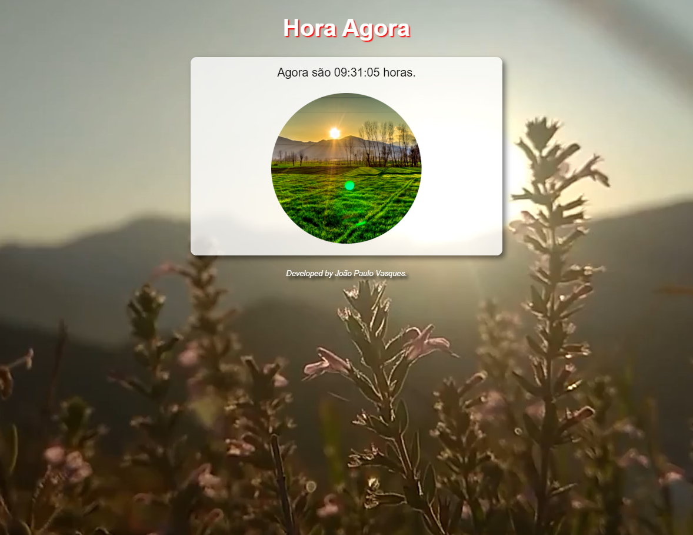
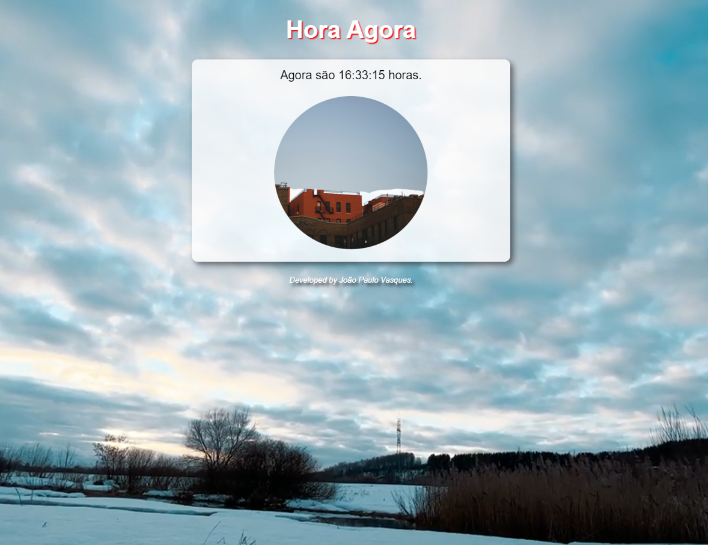

# Hora Agora - Curso em Vídeo

>Hora Agora

Projeto construído no curso de Javascript da plataforma Curso em Vídeo.
Realizados alguns implementos pessoais:
- As imagens de centro foram dimensionadas por CSS (no curso o professor manipulou no PS)
- Background em vídeo que se altera conforme a fase do dia (manhã - tarde - noite).

[Clique Aqui Para Acesar](https://vasquesjp.github.io/HoraAgora)

## ⚙ Tecnologias 

- HTML
- CSS
- JS
- Git e Github

## 📧 Contato

vasquesjp@hotmail.com